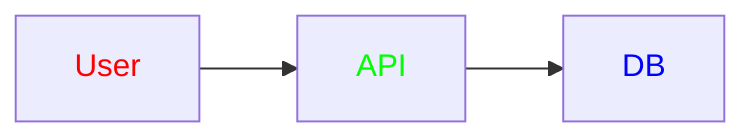
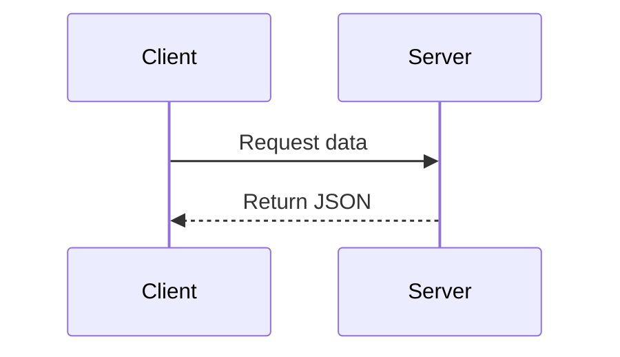

# My Awesome Architecture

This document describes how our system works. GitHub will render the diagram below automatically!

# Diagram A

```mermaid
graph LR
classDef user color:#ff0000
classDef service color:#00ff00
classDef db color:#0000ff

User:::user --> API:::service
API --> DB:::db
```

And here is a sequence diagram!

# Diagram B

```mermaid
sequenceDiagram
    Client->>Server: Request data
    Server-->>Client: Return JSON
```